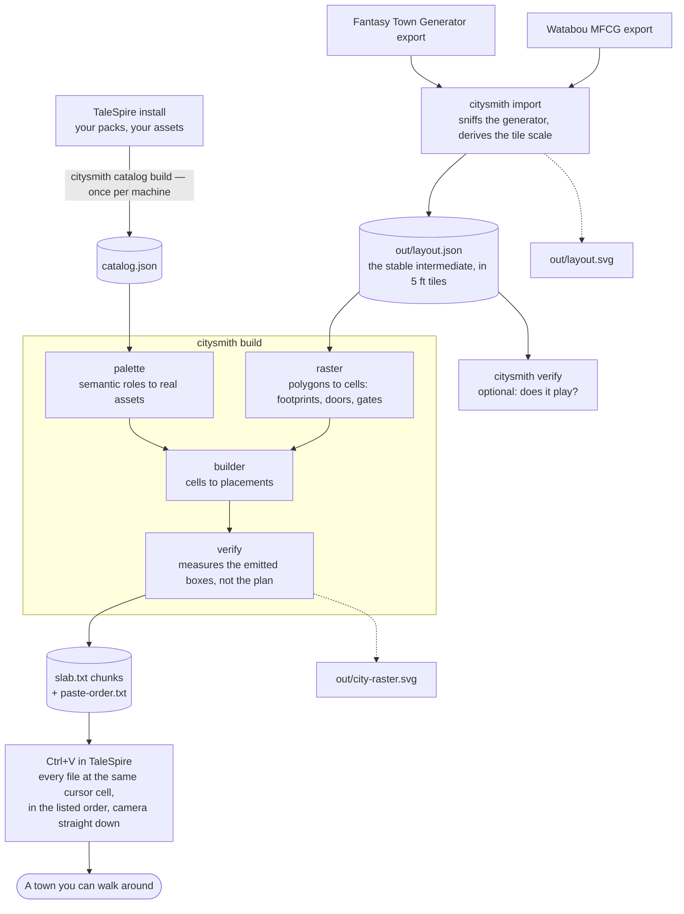
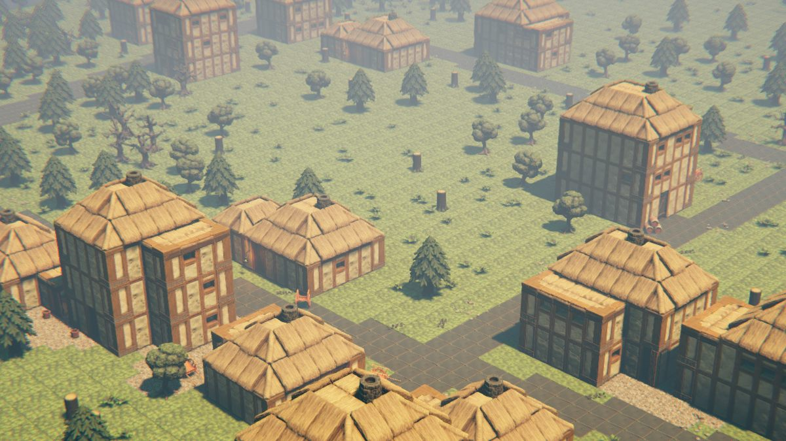
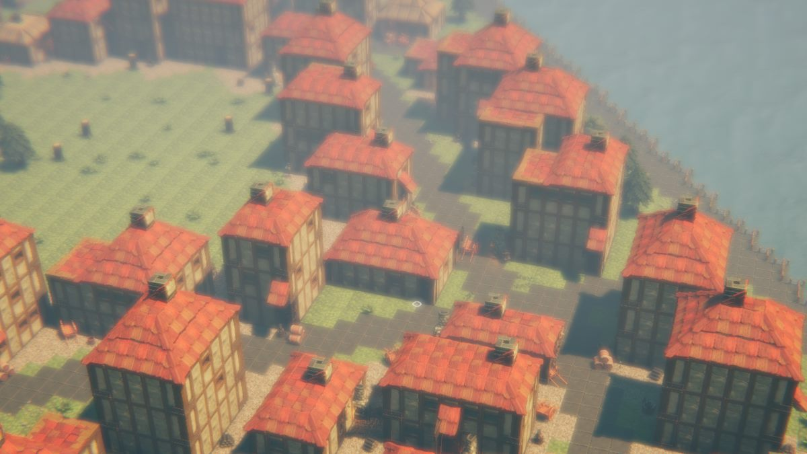
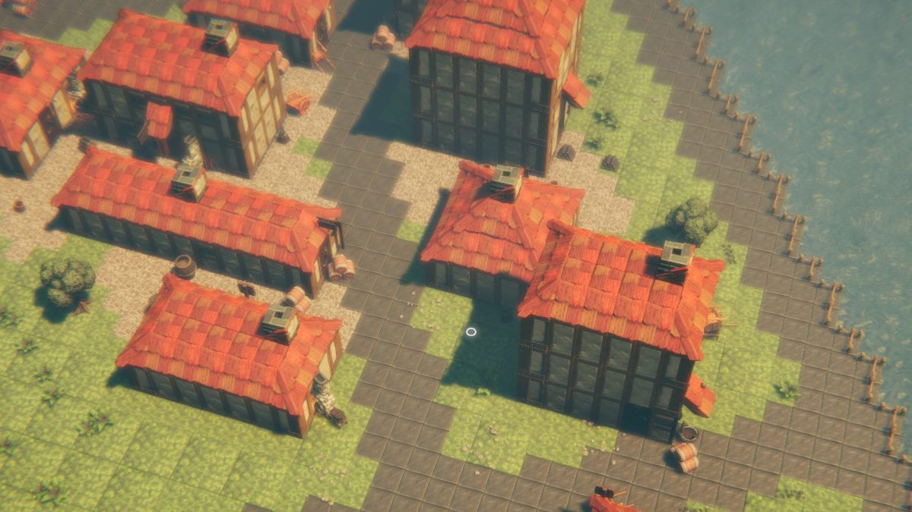

# citysmith

Turn a fantasy-town map export into a playable **TaleSpire** board.

citysmith reads a GeoJSON town from [Watabou's Medieval Fantasy City
Generator][mfcg] or from [Fantasy Town Generator][ftg], scales it to a 5 ft tile
grid, rasterises it into ground / street / water / building / wall cells,
dresses it with real assets **from your own TaleSpire install**, and emits
`.slab.txt` files you paste into the game with `Ctrl+V`.

It also has a self-contained procedural city generator and an interior
floorplan builder, but the import path is the one that produces a whole town.

[mfcg]: https://watabou.github.io/city-generator/
[ftg]: https://www.fantasytowngenerator.com/

---

## The process, end to end



Three things in that diagram are load-bearing and easy to miss:

- **`catalog.json` is built from *your* TaleSpire install** and is not
  committed. Two people with different DLC will get different-looking towns
  from the same layout, and that is by design — citysmith can only build with
  what you own.
- **`layout.json` is the stable intermediate.** It is plain JSON in 5 ft tiles.
  Hand-edit it, keep it in version control, diff it. Everything downstream is
  deterministic from it plus a seed.
- **The paste order is not the filename order.** `build` writes
  `<stem>-paste-order.txt` next to the slabs; follow it.

---

## Setup

### Prerequisites

| | |
|---|---|
| **TaleSpire, installed** | citysmith reads asset ids, names, tags and collider bounds straight out of `<install>/Taleweaver/<pack-uuid>/index.json`. Whatever packs you own are what it can build with. Nothing is bundled. |
| **Python 3.10+** | Developed on 3.14. |
| **Dependencies** | None. The core is stdlib-only. `anthropic` is an optional extra used by one command (`brief`); everything else works offline. |

### Install

```bash
git clone https://github.com/jchallenger/citysmith.git
cd citysmith
pip install -e .
```

Or skip installing and run `python -m citysmith ...` from the repo root.

### Index your assets (once per install, or after buying packs)

```bash
python -m citysmith catalog build
```

Writes `catalog.json`. It finds TaleSpire via Steam automatically; if it can't,
set the `TALESPIRE_PATH` environment variable or pass
`--talespire-path "D:\SteamLibrary\steamapps\common\TaleSpire"`.

Check it worked:

```bash
python -m citysmith catalog search --group wall --tag stone --limit 5
```

---

## Quick start

**1 · Get a map.** Generate a town at <https://watabou.github.io/city-generator/>
and use its export menu to save the **JSON** (GeoJSON) export. Fantasy Town
Generator exports work too — citysmith sniffs which generator a file came from
by reading its features, because **the file extension does not tell them
apart** (both generators ship both `.json` and `.geojson`).

**2 · Import it.**

```bash
python -m citysmith import mytown.json
```

Writes `out/layout.json` and `out/layout.svg`.

The tile scale is *derived*, not guessed. MFCG exports have no real-world
units, so the map is anchored to a median building width (`--house-ft`, default
35 ft) and the tile count follows. 35 is chosen for play: below about 30 most
buildings are too small to stand a party in — at 20 ft only 31% clear a 3×3
interior, at 35 ft 94% do, and above 35 buys nothing further. FTG states its
own scale (1 unit = 1 metre) so nothing is inferred there; the two routes agree
within 4% on every export tested.

`--margin-ft` (default 60) sets how much suburb is kept outside the walls;
`--no-clip` keeps the whole export. Playability warnings print here.

**3 · Check it plays** — optional but cheap:

```bash
python -m citysmith verify out/layout.json
```

**4 · Build the slabs.**

```bash
python -m citysmith build out/layout.json --by-region --stem mytown
```

Writes `out/mytown-rNNcNN.slab.txt`, `out/mytown-paste-order.txt` and
`out/city-raster.svg`, then prints the verification report and a table of which
chunk covers which tile range.

**5 · Paste into TaleSpire.** Open each slab file, copy the whole contents, and
in build mode press `Ctrl+V`. The slab arrives *in hand at the cursor*; commit
it with a left press **held for about a fifth of a second** — a zero-duration
click is swallowed by Unity's input polling.

> **Read [docs/pasting-into-talespire.md](docs/pasting-into-talespire.md)
> before your first paste.** The interaction is unforgiving and every failure
> mode looks like the tool is broken rather than the input.

The three rules that matter most:

1. **Pitch the camera straight down and leave it there.** A paste anchors on
   the cursor's *ray hit*, so with the camera tilted, anything already on the
   ground slides the anchor toward you.
2. **Paste every file at the same cursor cell**, in the order
   `paste-order.txt` lists. Every chunk carries the map's registration markers,
   so they present an identical bounding box and assemble with no measuring.
   The last file covers the anchor cell and must land last.
3. **Empty the hand after each paste** with a right-click *tap*. A held
   right-click reads as a drag and the slab stays in hand — so every later
   click stamps another copy of the town.

---

## Build modes

| Mode | Flag | What it is for |
|---|---|---|
| **Tiled** *(recommended)* | `--by-region` | One slab per map region, every layer together. Chunks tile the map without overlapping, so nothing is ever pasted over anything and no chunk can inherit another's height. |
| Layered | *(default)* | Landscape first, then structures over it. Fewer, larger files, and lets you re-paste just the buildings after a change — at the cost of the second layer resting on the first. |
| Per building | `--per-building` | One slab per building plus one for the rampart. Dozens of files; the mode for checking a single house without re-laying the town. |

Other useful flags: `--style {medieval,cyberpunk}`, `--seed N`, `--storeys N`
(ceiling on building height, default 3), `--no-roofs`, `--no-bridges`,
`--max-assets N`, `--chunk-tiles N`, `--keep-open-country`,
`--crop X,Z,W,D` (build one region for a staged in-game test), `--scale N`.

---

## What it actually builds

**Buildings are dealt one of four fabrics** by kind, so importance reads off the
architecture rather than off storey count:

| Tier | Kinds | Walls | Roof |
|---|---|---|---|
| civic | temple, guildhall, manor, barracks | dressed castle stone, arched windows, fancy door | grey slate |
| trade | tavern, shop, apothecary, smithy | timber frame, better door, glazed street front | terracotta tile |
| common | house and everything else | timber frame, peasant door | thatch |
| utility | warehouse, stable, shed | dark boarding, **one storey, no windows** | thatch |

Glazing is keyed on which face a wall segment sits on — dense at the front,
sparse on the flank, **never at the back** — and a building fronting a main
street gets the show facade. Single-storey buildings get a lantern by the door
where a porch would sit level with their own eaves.

**The town wall** is a faced rampart 35 ft to the wall-walk and 45 ft to the top
of the merlons, with square mural towers at every corner and flanking every
gate. Gate passages are cut square through the band so the portcullis has
straight jambs to hang on, and a stair runs up the inside of the wall at each
tower — parallel to the curtain, landing flush with the wall-walk, and never
on the field side, because a stair outside a town wall is a siege ramp for the
enemy.

### What that looks like at three scales

Three real Fantasy Town Generator exports, built and pasted end to end. The
numbers are what the tool actually reported, not estimates; every screenshot
below is off the finished board:

| Town | Tiles | Buildings | Assets | Chunks | `--chunk-tiles` |
|---|---|---|---|---|---|
| Pelvesthollow — a hamlet in woodland | 175 × 184 | 35 | 20,647 | 9 | 64 |
| Graybank — a river village | 434 × 305 | 150 | 91,609 | 24 | 80 |
| East Tradebourne — a walled town | 739 × 598 | 991 | 386,562 | 114 | 112 |

East Tradebourne is 38.7% of the per-board asset limit, so a town roughly two
and a half times its size is the ceiling.

#### Pelvesthollow — 35 buildings


Common-tier fabric: timber frame, thatch, a peasant door. The lane is cobble
laid by its *top* surface, not its bottom — cobble is 0.25 thick and grass is
0.5, so aligning them at the base would put a 15-inch kerb along every street.




#### Graybank — 150 buildings


Trade tier beside common tier. Importance reads off the *roof material* rather
than off storey count, because a facade that changes material at the corner
reads as a mistake.


A single-storey building gets a lantern by the door instead of a porch: a porch
hood seats at `storey_h + 0.5`, which on a one-storey cottage is level with its
own eaves — a second roof grafted onto the first.

#### East Tradebourne — 991 buildings, walled


A faced rampart, 35 ft to the wall-walk and 45 ft to the top of the merlons.
The mass is a full-cell block with the thin curtain pieces hung on the faces
that show — a wall built from 0.5-deep curtain pieces laid one per cell scores
perfectly on any check that reads the tile grid while being visibly
see-through on the board. The ground outside is clear because a rampart counts
as *built* for the woodland falloff; seeded from buildings alone, pines grew
flush against the masonry.


FTG exports a market square as a `BUILDING` with `material: PAVEMENT`. Built as
one it is a roofed box over the square, so it is diverted into a plaza instead —
this is that rule working on the file it was written for.





**Sizing the chunks is a two-regime problem, and most people only meet the
first.** Below about 90,000 assets the *byte cap* binds: pick a cell size whose
largest slab lands near two thirds of 30,720, because a different seed can
push it over. Graybank at 96 tiles is 20 chunks and 29,817 bytes — 97% of the
cap and too close; at 80 tiles it is 24 chunks and 20,772 bytes. Above that,
`--max-assets` binds instead and the cell size stops mattering: East
Tradebourne at 80 / 112 / 160 tiles gives 146 / 114 / 137 chunks and all three
land within 40 bytes of the same slab size. In that regime pick the size that
*splits least* — 160 is worse than 112, because an oversized cell splits into
four where a smaller one would not have split at all.

### One board per town

A campaign holds many boards, and `review.ps1 tiled` creates a fresh one for
each map so nothing is ever pasted over anything:

```bash
pwsh tools/review.ps1 tiled -Name gb -Stem gb -OutDir out\graybank -ShotEvery 6
```
```bash
pwsh tools/ts.ps1 rename -Text "Graybank"
```

`-ShotEvery N` thins the progress screenshots; a 114-chunk town otherwise takes
228 of them. New boards are called `Unknown Realm N` and the numbers get
reused, so name them. See
[.claude/skills/talespire-boards/SKILL.md](.claude/skills/talespire-boards/SKILL.md).

---

## Outputs

| File | What it is |
|---|---|
| `catalog.json` | Your TaleSpire asset index. Machine-local; gitignored. |
| `out/layout.json` | The imported town in 5 ft tiles: walls, gates, roads, districts, buildings, areas. The stable intermediate — hand-edit it if you like. |
| `out/layout.svg` | Polygonal reference map of the import. |
| `out/city-raster.svg` | The rasterised tile grid, with unreachable pockets in red, gates in yellow, added bridges in blue. **This is the file to look at when something is wrong.** |
| `out/<stem>-rNNcNN.slab.txt` | The pasteable chunks: base64 of gzipped binary. |
| `out/<stem>-paste-order.txt` | The order to paste them in. Not alphabetical. |

The procedural path additionally writes `out/city.json` / `city.svg`,
`out/<site>.plan.json` / `.plan.svg`, and `out/<site>.slab.txt`.

---

## Known limits

- **30,720 compressed bytes per slab.** A whole town does not fit, so `build`
  cuts it into chunks. Every chunk carries the *whole map's* registration
  markers so they share one bounding box — paste them at one anchor and they
  assemble. Move the camera between pastes and they do not.
- **1 tile = 5 ft, and a creature occupies one tile.** Everything is derived
  from that. A town whose median house is under ~4 tiles across has no room to
  fight indoors; `import` warns when the derived scale lands there.
- **Board limits:** 2000 × 2000 grid units, 1,000,000 assets. `verify` checks
  both.
- **Pasting is the only ingestion path.** `talespire://` links do not import
  boards, and there is no file-drop or API. Everything goes through `Ctrl+V`.
- **No creatures.** `creatureCount` is always 0 in the slabs we emit.
- **A walled town currently fails one placement check.** `_lay_city_wall`
  lays only the top course in a rampart cell walled in on all four sides —
  nothing can see the rest — while `verify` samples the second course and so
  reports every such cell as a hole: 732 of East Tradebourne's 2,367. The wall
  is unbroken coursed stone from the ground to the parapet when you look at it,
  and the void only exists where no camera can reach; but the build does print
  `[FAIL]` and the slabs are written anyway.
- **No interiors on the town board.** `floorplan.py` builds them, but nothing
  wires an interior onto a second board per building yet.
- **No UI.** `cli.py` is a thin shell over the core modules; a UI would slot in
  without touching generation code, but it does not exist yet.

---

## The other pipeline: procedural city + interiors

Generates a town from a seed instead of importing one, then builds a battle-map
interior for one building.

```bash
python -m citysmith city --seed 42 --size town --style medieval
python -m citysmith sites out/city.json --top 10
python -m citysmith plan out/city.json --site tavern-015
python -m citysmith design out/tavern-015.plan.json
python -m citysmith board out/city.json          # coarse 3D city shell
```

`--size` takes `hamlet | village | town | city | metropolis` (48/72/104/144/200
tiles) or a raw tile count. `sites` scores every building on encounter
potential and shows its reasoning, so you can disagree with the ranking and see
which signal to override. `pipeline` runs city → sites → plan → design in one
command.

---

## Optional: natural language

With `pip install -e ".[ai]"` and `ANTHROPIC_API_KEY` set:

```bash
python -m citysmith brief "a rainy harbour town run by three smuggling families" --describe
```

Claude only chooses generator parameters and writes GM notes. It never emits
coordinates, asset ids, or slab bytes — all geometry is deterministic Python,
so a bad model response gives you a boring city, never a broken one.

---

## Tools

`tools/` holds the workshop, not the product. Two are worth knowing about:

```bash
python tools/kit_index.py --complete      # which asset kits can build a house
python tools/kit_index.py --kit Tavern    # everything in one kit
```

`kit_index.py` regenerates [docs/asset-index.md](docs/asset-index.md), the
searchable dump of your library grouped by kit. **The kit is the catalog's
`folder`** — `pack` is the DLC and `group_tag` is a form, so neither tells you
whether two pieces belong together.

The `*_probe.py` scripts each build one question as a slab you paste and look
at — roof rotations, wall masses, corner pairings. The standing rule on this
project is that an asset's shape is never assumed from its name or its
measurements; it is probed and read from four sides. `tools/review.ps1` and
`tools/ts.ps1` drive TaleSpire over Windows synthetic input to do that
automatically (Windows only, and the game must be windowed).

---

## Docs

- [docs/pasting-into-talespire.md](docs/pasting-into-talespire.md) — how to get
  a slab into the game without fighting it.
- [docs/asset-conventions.md](docs/asset-conventions.md) — footprint, pinning,
  normalization and roof-rotation rules.
- `docs/asset-index.md` — a generated index of *your* asset library, by kit.
  Not in the repo, because it is a dump of your TaleSpire packs; run
  `python tools/kit_index.py` to produce it locally.
- [docs/ftg-geojson-import.md](docs/ftg-geojson-import.md) — the Fantasy Town
  Generator schema, reverse-engineered.
- [docs/slab-format-v2.md](docs/slab-format-v2.md) — BouncyRock's official slab
  format spec, kept alongside the implementation in `citysmith/slab.py`.
- [.claude/skills/talespire-boards/SKILL.md](.claude/skills/talespire-boards/SKILL.md)
  — campaigns and boards: creating, naming, switching, and a board per town.
- [CLAUDE.md](CLAUDE.md) — internal engineering notes, module map, and a long
  record of what was tried and why it failed. Read this before changing
  generation code.

---

## Testing

```bash
python -m pytest -q
```

228 tests. The slab codec is tested against real TaleSpire slabs in
`tests/fixtures/` — decoding and re-encoding reproduces the original binary
byte for byte. Generator tests assert *invariants* (no overlapping buildings,
no unreachable rooms, walls resting on floors, no window on the back of a
building) rather than exact output, so aesthetics can change freely but real
bugs cannot come back silently.

## Verifying placement in-game

```bash
python -m citysmith calibrate
```

Emits `out/calibrate.slab.txt`: a 9×3 floor pad with four walls in the middle
row, each hugging one named edge of its own tile. Paste it, look straight down,
and confirm the rotation convention holds for your packs.

## Third-party content

citysmith **ships no TaleSpire assets and no asset data.** It reads names, tags
and collider bounds out of the TaleSpire installation on the machine it runs
on, at run time, into a local `catalog.json` that is not committed. The
generated `docs/asset-index.md` is the same story and is likewise local. Slab
files the tool emits reference assets by id — they are only meaningful to
someone who already owns the packs.

What the repo does contain, and where it came from:

| | |
|---|---|
| `samples/forest_church.json` | A town exported from [Watabou's Medieval Fantasy City Generator][mfcg]. Kept as a worked example so the pipeline is runnable without generating your own first. |
| `docs/images/*.jpg` | Screenshots of boards this tool built, taken in TaleSpire. They depict TaleSpire assets. |
| `tests/fixtures/*.slab` | Real slabs, used as ground truth for the codec — a codec tested only on its own output is a codec that agrees with itself. They are data files listing asset ids and coordinates, not asset content. |
| `docs/slab-format-v2.md` | Our own description of BouncyRock's slab format, written from the implementation. The authoritative spec is BouncyRock's and lives with TaleSpire. |

TaleSpire and its asset packs are the property of BouncyRock Entertainment.
This project is not affiliated with or endorsed by them. Using it is subject to
whatever terms apply to your own TaleSpire licence, and that is on you.

## License

[Apache License 2.0](LICENSE). Use it, fork it, ship it; keep the notices, and
understand that it comes with no warranty of any kind.
